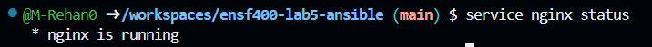

**A checklist for all the files provided for the grader:**

***Task 1***
----------------
* Nginx is installed on “localhost” using Ansible.

* Nginx config file is provided.

* Nginx is successfully installed on “localhost” instead of an updated docker-compose.yml:

    

* Updated inventory file (hosts.yml) is provided.

* Updated hello.yml file is provided.

***Task 2***
----------------
* A Python file load inventory.py for the first task is provided.
* A Python file run playbook.py for the second task is provided.